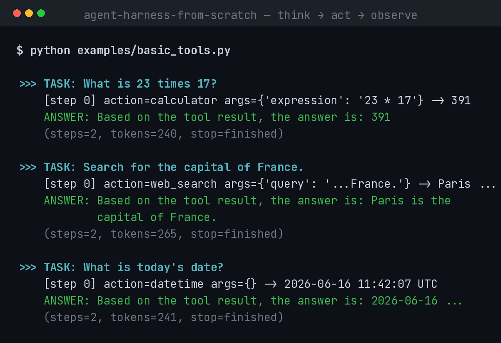
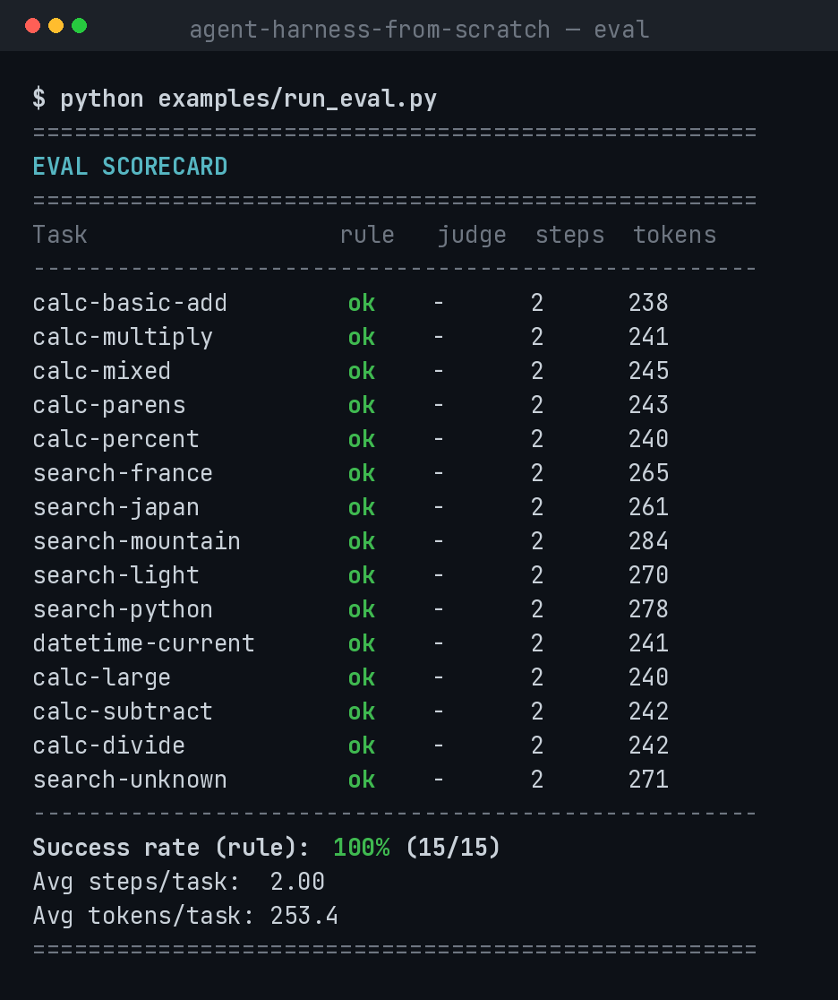
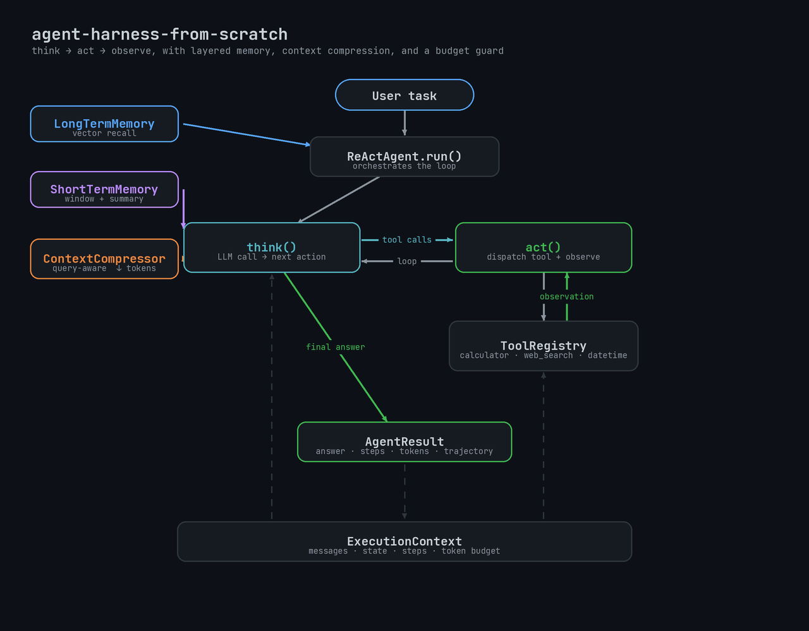

# agent-harness-from-scratch

A minimal, production-shaped **ReAct agent framework** built from first principles in pure Python — no LangChain, no LlamaIndex. The goal is to show the *internals* of an agent runtime: the think–act loop, an execution context, a typed tool abstraction, memory, guardrails, and an evaluation harness.

[](https://github.com/sudhanshu-shivam-dev/agent-harness-from-scratch/actions/workflows/ci.yml)

## Live demo

An interactive **ReAct Agent Playground** that visualizes the think → act →
observe loop in the browser: <!-- TODO: paste your published demo URL here -->
**_(coming soon)_**. Source lives in [`web/`](web/) — run it locally with
`cd web && npm install && npm run dev`.

## See it in action

The agent reasoning and calling tools (`python examples/basic_tools.py`):



The evaluation harness scoring the agent over the sample tasks
(`python examples/run_eval.py`) — runs on the zero-dependency mock LLM:



## Why this exists

Most "agent" projects wire together a framework and call it a day. This one implements the pieces that actually matter in production:

- **ExecutionContext** — owns state, step history, and a token/step budget
- **Tool abstraction** — a `@tool` decorator that auto-generates JSON schemas from function signatures
- **Memory** — short-term context management (window + summarization) and long-term vector recall
- **Context compression** — query-aware compression that shrinks the input before the LLM call, inspired by recent long-context research
- **Guardrails** — max-step limits, finish/confidence checks, and safe handling of malformed tool calls
- **Evaluation harness** — runs the agent over a task set, logs full trajectories, and scores with rule-based + LLM-as-judge

It runs **with zero setup and no API key** thanks to a deterministic `MockLLM`, and switches to a real model when `OPENAI_API_KEY` is provided.

## Architecture

The agent is a `think → act → observe` loop. A single `ExecutionContext` threads
through every iteration and owns all mutable state (messages, scratch state, the
step-by-step trajectory, and the token/step budget). Tools are typed and
self-describing; memory is layered into short-term and long-term; and an optional
context compressor shrinks the input before each LLM call.



Each loop iteration:

1. **`think()`** — one LLM call (after short-term memory management) returning
   either tool calls or a final answer.
2. **`act()`** — dispatch the requested tool(s), capture observations, and feed
   them back into the transcript. Malformed calls are retried once, then fail
   cleanly.
3. The budget guard on `ExecutionContext` stops the loop at the step or token
   limit, so a run can never spin forever.

## Quickstart

```bash
pip install -r requirements.txt
cp .env.example .env   # add OPENAI_API_KEY, or run with the mock LLM
python examples/basic_tools.py
python examples/run_eval.py
```

Everything above works **without an API key** (it uses `MockLLM`). To run against
a real model, set `USE_OPENAI=1` and `OPENAI_API_KEY` in your `.env`.

### A 30-second taste

```python
from agent import MockLLM, ReActAgent, ToolRegistry, tool

@tool
def calculator(expression: str) -> str:
    """Evaluate an arithmetic expression."""
    return str(eval(expression))  # the repo ships a *safe* evaluator instead

agent = ReActAgent(llm=MockLLM(), tools=ToolRegistry([calculator]))
print(agent.run("What is 23 times 17?").answer)
# -> Based on the tool result, the answer is: 391
```

## Evaluation

Run `python examples/run_eval.py` to score the agent over the sample tasks
(`agent/eval/tasks.json`). Add `--judge` for the optional LLM-as-judge pass and
`--dump results.json` to write full trajectories. Example scorecard (MockLLM):

| Metric | Value |
|---|---|
| Tasks | 15 |
| Success rate (rule-based) | 100% |
| Success rate (LLM-as-judge) | 100% |
| Avg steps/task | 2.00 |
| Avg tokens/task | ~253 |

Scoring is two-layered: a **rule-based** check (expected substrings present, the
expected tool was actually invoked, and the agent finished cleanly rather than
being force-stopped) and an optional **LLM-as-judge** pass for open-ended
answers. Numbers above are from the deterministic mock; with a real model they
reflect that model's quality.

## Context compression

Long-context agents waste most of their tokens re-sending tool outputs and
documents the model has already seen. Recent research shows that aggressively
compressing the input *before* it reaches the model preserves task accuracy while
cutting compute and latency — *Latent Context Language Models* (Chari et al.,
2025) report up to **16× compression** by compressing the input sequence ahead of
the decoder, and *ACON* targets this for long-horizon LLM agents specifically.

`ContextCompressor` implements a lightweight, model-free approximation of that
idea: a **selective, query-aware extractive compressor**. It splits context into
units, scores each for relevance to the current query, and keeps only the
highest-value units up to a target ratio — no trained encoder, fully
deterministic, zero extra dependencies.

```python
from agent import ContextCompressor

compressor = ContextCompressor(target_ratio=4.0)
result = compressor.compress(long_document, query="Why were there shipping delays?")
print(result.summary())   # e.g. "229->58 tokens (3.9x, kept 3/12 units)"
```

Wire it into an agent and it transparently compresses large message bodies before
each `think()` call:

```python
agent = ReActAgent(llm=..., tools=..., compressor=ContextCompressor(target_ratio=4.0))
```

See `examples/context_compression.py` for a runnable demo.

## Design notes

**Why ReAct.** Interleaving reasoning and acting keeps the agent grounded: every
action produces an observation that conditions the next thought, which is far
more robust than asking a model to plan an entire tool sequence up front. It also
makes the loop trivially inspectable — each step is a `(thought, action,
observation)` triple you can log and replay.

**Why an explicit context object.** Mutable run state is the thing that bites you
in production: it leaks across requests, makes runs impossible to reproduce, and
hides the token/step budget. Putting *all* of it in one `ExecutionContext` means
there is exactly one place to serialize for logging, one place to enforce the
budget, and one place to reset between tasks (the eval harness builds a fresh
agent per task for exactly this reason).

**How the budget guard prevents runaway loops.** The loop checks
`ctx.over_budget()` before every step, and both the step count and cumulative
token total are hard caps. A model that keeps calling tools, or keeps emitting
malformed calls, hits the ceiling and the run ends with a graceful "stopped"
answer plus the last useful observation — never an infinite spend.

**How memory is layered.** Short-term memory keeps a sliding window of recent
messages and summarizes the overflow so the prompt stays inside the model's
budget. Long-term memory is a separate concern: an embedding store that recalls
relevant facts from *past* runs and primes the system prompt. Splitting them
mirrors how production agents separate "what's in this conversation" from "what
we've learned over time."

**Why compress context.** Token cost and latency in agent loops are dominated by
re-sending history and tool outputs. Compressing the input before the model call
— rather than only summarizing across turns — keeps the budget flat as
trajectories grow. The compressor lives behind a small `compress()` interface, so
the model-free extractive implementation here can be swapped for a trained
encoder (the approach the LCLM/ACON papers take) without touching the agent.

**What I'd change to scale this.** Make tool dispatch async so independent calls
run concurrently; replace the in-memory NumPy store with a real vector DB
(FAISS/Qdrant/pgvector) and persist it; swap the extractive compressor for a
trained context encoder; add streaming and partial-result handling; and introduce
a planner/executor split for multi-step tasks so a higher-level agent decomposes
work and delegates to focused sub-agents.

## Project layout

```
agent/
  context.py       ExecutionContext: messages, state, step history, token budget
  tools.py         BaseTool + @tool decorator (auto JSON schema) + ToolRegistry
  memory.py        short-term (window/summary) + long-term (vector) memory
  compression.py   ContextCompressor: query-aware context compression
  llm.py           LLM client wrapper: MockLLM (offline) + OpenAILLM (real)
  agent.py         ReActAgent: run()/step()/think()/act() loop + guardrails
  eval/
    harness.py     runs the agent over tasks, logs trajectories, scores
    tasks.json     sample eval tasks with expected outcomes
examples/
  basic_tools.py         calculator + web-search-stub + datetime tools
  context_compression.py query-aware context compression demo
  memory_demo.py         long-term vector memory recall demo
  run_eval.py            runs the eval harness and prints a scorecard
tests/
  test_agent.py          unit + integration tests (run entirely on MockLLM)
  test_compression.py    tests for the context compressor
web/
  ReAct Agent Playground — interactive browser demo (Vite + React + TS)
```

## Roadmap

- [ ] Async multi-agent orchestration (planner/executor)
- [ ] MCP tool integration
- [ ] Persistent vector memory (FAISS/Qdrant)
- [ ] Trained context encoder (LCLM/ACON-style) behind the compressor interface

## License

MIT
